# Chamber Shape
## Руководство пользователя
Chamber Shape - это графический интерфейс для прецизионного кода.

### 1. Стартовое окно
Первое, что вы увидите при запуске программы - это стартовое окно. 
Здесь находятся кнопки "Создать проект", "Открыть проект" и "Руководство пользователя",
 а также список недавних проектов.

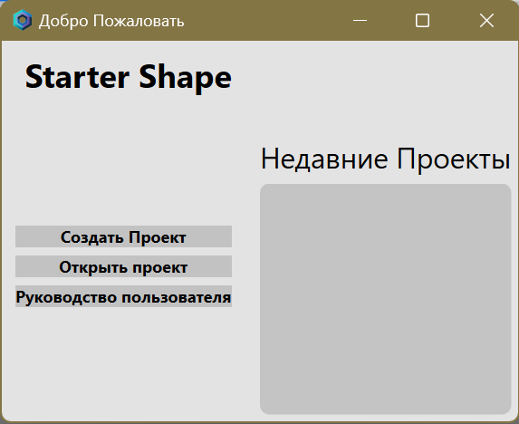

#### Создать проект
При нажатии на эту кнопку стартовое окно принимает вид формы создания нового проекта.

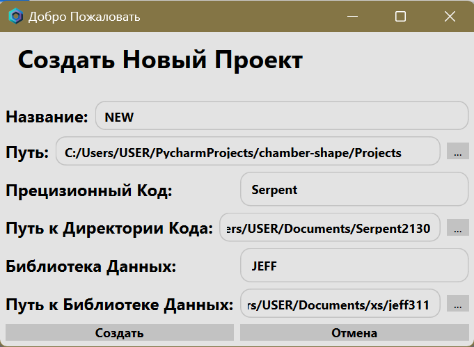

Вам предлагается заполнить поля:
>**Название**
>
>_Придумайте и введите здесь название вашего нового проекта._

>**Путь**
>
>_Нажмите на кнопку `...` напротив этого поля и выберите папку, в которую
> будут сохраняться файлы вашего проекта._

>**Прецизионный код**
>
>_Здесь необходимо выбрать один из доступных прецизионных кодов, с которым вы хотите
> работать._

>**Путь к директории кода**
>
>_Нажмите на кнопку `...` напротив этого поля и выберите папку, содержащую 
> исполняемый файл прецизионного кода, с которым вы будете работать._

>**Библиотека данных**
>
>_Здесь необходимо выбрать одну из доступных библиотек ядерных данных, с которой
> вы хотите работать._

>**Путь к библиотеке данных**
>
>_Нажмите на кнопку `...` напротив этого поля и выберите папку, хранящую 
> файлы библиотек ядерных данных, с которыми вы будете работать._

После этого вы можете нажать кнопку "Создать" и приступить к работе в программе, 
либо нажать кнопку "Отмена" и вернуться к стартовому окну.

#### Открыть проект
Нажав на эту кнопку вы можете открыть уже существующий проект, 
выбрав в проводнике соответствующую папку.

#### Руководство пользователя
При нажатии на эту кнопку открывается руководство пользователя.

### 2. Основное окно
После создания или открытия проекта, вам предоставляется рабочая область, разделенная
на несколько блоков. 

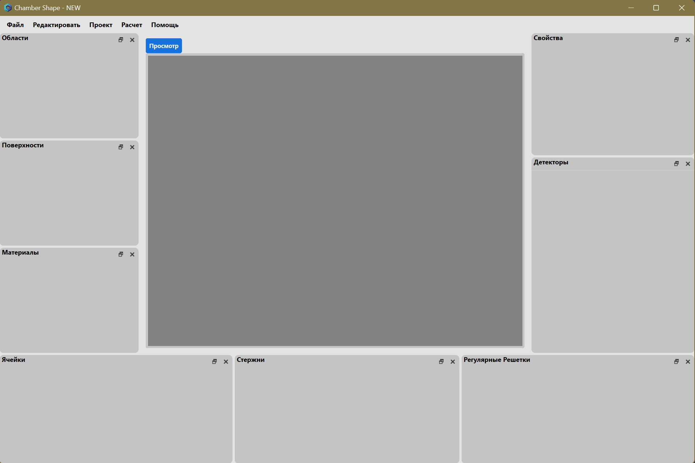

#### Строка меню
В верхнем левом углу рабочей области расположено меню с пунктами: "Файл", 
"Редактировать", "Проект", "Расчет" и "Помощь".

> #### Файл
>Содержит следующие подпункты:
>- **Новый проект** _- позволяет открыть форму создания нового проекта._
>- **Открыть** _- позволяет открыть другой существующий проект._
>- **Сохранить** _- позволяет сохранить изменения в проекте._
>- **Сохранить как** _- позволяет сохранить открытый проект в новую папку._
>- **Параметры** _- открывает окно настроек приложения, в котором можно поменять
>цветовую тему и язык интерфейса._

> #### Редактировать
>Содержит следующие подпункты:
>- **Вырезать**
>- **Копировать**
>- **Вставить**

> #### Проект
>Содержит следующие подпункты:
>- **Запустить расчет** _- подает входной файл на исполнение подключенному прецизионному
>коду._
>- **Открыть входные данные** _- открывает окно для просмотра содержимого файла входных 
>данных._

> #### Расчет
>Содержит следующие подпункты:
>- **Размножение нейтронов** _- позволяет в окне "Свойства" задать параметры размножения 
>нейтронов._
>- **Граничные условия** _- позволяет в окне "Свойства" задать граничные условия._
>- **Энергетическая сетка** _- позволяет в окне "Свойства" задать параметры энергетической
>сетки._
>- **Результаты** _- выводит в окне "Свойства" результаты последнего проведенного расчета._

> #### Помощь
>Содержит следующие подпункты:
>- **Руководство**
>- **О программе**

#### Окно просмотра
В центре рабочей области приложения находится окно просмотра, которое имеет три режима:
"Просмотр", "Входные данные" и "График".
>**Просмотр**
>
>_Этот режим установлен по умолчанию и встречает вас при запуске программы. Здесь 
> визуализируется моделируемая вами геометрия. Модель можно рассматривать с разных сторон, 
> используя клавиши-стрелки и мышь, а также изменять масштаб при помощи колёсика мыши._
> 
> 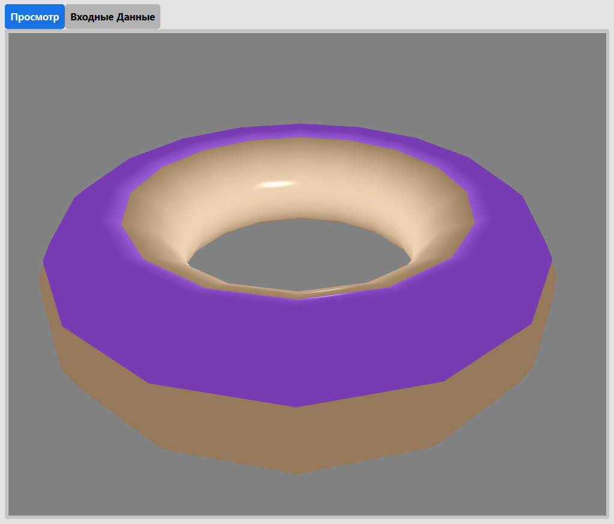

>**Входные данные**
>
>_Этот режим по умолчанию выключен, но в него можно перейти, воспользовавшись меню `Проект` и 
> выбрав в нём пункт `Открыть входные данные`. Так вы сможете увидеть, как сейчас выглядит 
> файл входных данных._
> 
> 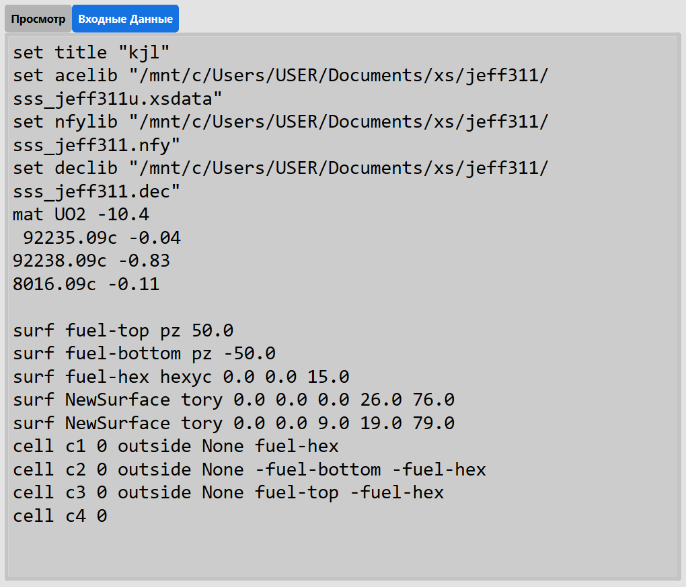

>**График**
>
>_Этот режим по умолчанию выключен, но в него можно перейти, если вы уже получили результат 
> расчета и хотите просмотреть графики, построенные по данным заданных вами детекторов. Для
> этого в списке детекторов выберите нужный, щелкните по нему правой кнопкой мыши, затем 
> выберите пункт меню `Показать диаграмму`. В окне просмотра откроется вкладка с графиком, 
> а её название будет соответствовать названию выбранного детектора._ 

#### Списки элементов 
Вокруг окна просмотра располагаются блоки со списками элементов: "Области",
"Поверхности", "Материалы", "Ячейки", "Стержни", "Регулярные решетки", "Детекторы".

В каждом блоке можно `Добавить` или `Удалить` соответствующий вид элемента. Для
этого нужно щелкнуть правой кнопкой мыши в пределах списка и выбрать одно из действий.

Блоки можно **менять местами**, **откреплять** от основного окна и **вкладывать** один блок 
в другой. Для перемещения блока нужно зажать левую кнопку мыши на заголовке списка
и потянуть. 
- Если просто отпустить кнопку мыши, то список _останется не закрепленным_ в виде 
отдельного окна. 
- Если отпустить кнопку мыши, когда курсор находится между двумя соседними 
блоками, то передвигаемый список _разместится между ними_. 
- Если отпустить кнопку мыши, когда курсор находится на каком-то из блоков, то 
передвигаемый список _превратится во вложенный_, и между двумя списками можно будет
переключаться при помощи вкладок.

При желании вы можете **регулировать высоту и ширину блоков**. Для этого наведите курсор
на край блока сверху, снизу, справа или слева. Убедитесь, что вид курсора изменился 
на двойную стрелку. Зажмите левую кнопку мыши и потяните край блока в нужную сторону.

В случае, если какой-то из списков вам мешает или не нужен в данный момент, вы можете
его **скрыть**. Для этого нажмите на крестик в правом верхнем углу блока. 

Когда список снова понадобится, его можно **вернуть**. Щелкните правой кнопкой мыши в 
любом свободном пространстве основного окна и откроется список всех возможных блоков.
Те, что сейчас отображаются, будут отмечены символом `✔`. Нажмите на скрытый блок, чтобы
снова его показать.

#### Работа со свойствами
Блок "Свойства" по умолчанию размещён в правом верхнем углу рабочей области. При создании
или выборе из списка какого-нибудь элемента, его параметры отобразятся в окне свойств.
Кроме того, такие настройки, как `Размножение нейтронов`, `Граничные условия`, `Энергетическая 
сетка`, тоже отображаются в блоке "Свойства".

Далее рассмотрим, какой вид принимает это окно в зависимости от вида настраиваемого 
элемента.

>**Поверхности**
>
> Каждой поверхности можно задать имя, цвет и положение в пространстве независимо от 
> выбранного типа. В зависимости от типа поверхность может иметь такие свойства, как
> высота, ширина, расстояние от начала координат по оси Z.
> 
> 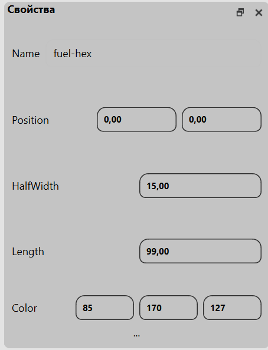

>**Материалы**
> 
>Каждому материалу можно задать имя, плотность, нуклиды, цвет. Чтобы добавить или 
> удалить нуклид, щелкните по списку правой кнопкой мыши и выберите действие. Чтобы
> редактировать нуклид, дважды щелкните по нему левой кнопкой мыши.
> 
> 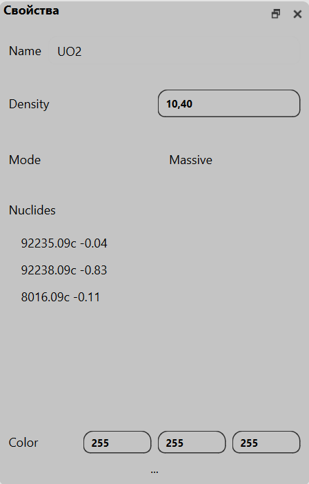

>**Ячейки**
> 
> Каждой ячейке можно задать имя, указать номер области, выбрать вариант заполнения и 
> внести в список поверхности, описывающие ячейку. 
> 
> 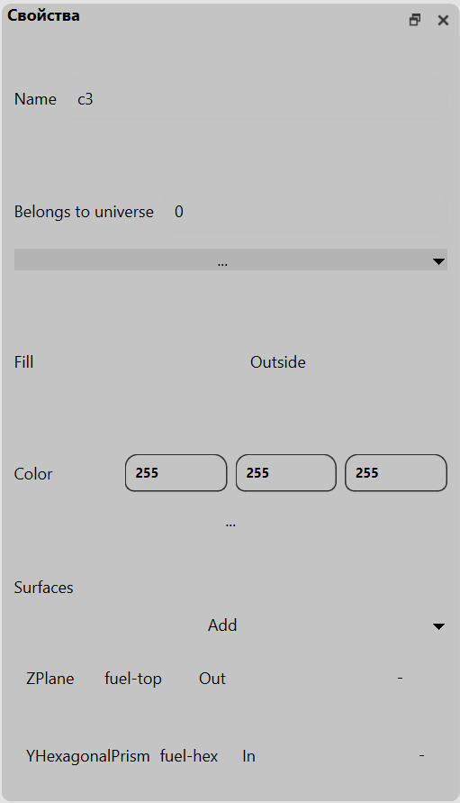
>
> Для указания области нажмите на кнопку `...` и выберите из списка нужную область.
> 
> 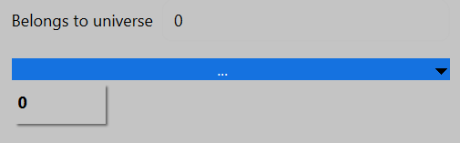
> 
> Существуют следующие варианты заполнения: `Void`, `Outside`, `Material`, `Universe`.
> - При выборе варианта `Material` появится кнопка `...`. Нажмите на неё, чтобы выбрать один
> материал из списка существующих. 
> - При выборе варианта `Universe` вы точно также сможете выбрать одну из областей.
> 
> 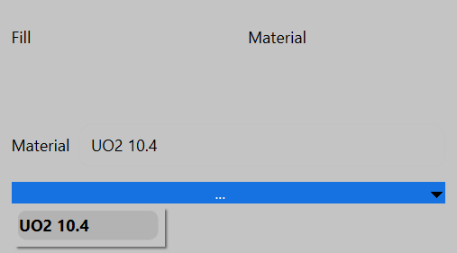
> 
>> _В случае, если кнопка `...` не появилась, попробуйте переключиться на другой элемент и снова
>> выделить ячейку, с которой вы работали._
> 
> Для добавления поверхностей, описывающих ячейку, существует кнопка `Add`. Нажмите на нее 
> и выбирайте из списка необходимые поверхности. Для очистки списка нажимайте на кнопку `-` 
> напротив поверхностей, которые хотите удалить.
> 
> 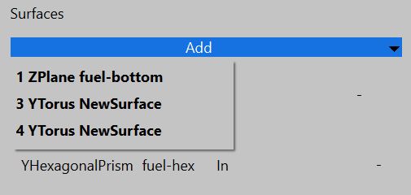

>**Стержни**
> 
> Каждому стержню можно задать имя, указать номер области и материалы, из которых он 
> состоит. 
> 
> Для указания области нажмите на кнопку `...` и выберите из списка нужную область.
> 
> 
> 
> Для того чтобы задать материалы стержня, нажмите на кнопку `Add` и выберите нужный 
> элемент из списка. В строке каждого материала есть поле для указания радиуса. Когда
> вам понадобится удалить материал из списка, нажмите на кнопку `-`.
> 
> 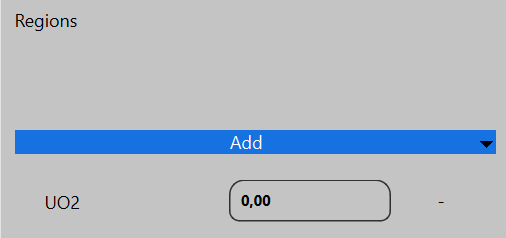

>**Регулярные решетки**
>
> Каждой решетке можно задать имя, указать номер области, задать координаты X и Y для 
> центра решетки, определить число ячеек в направлениях координат, задать шаг ячейки,
> а также заполнить решетку стержнями.
> 
> 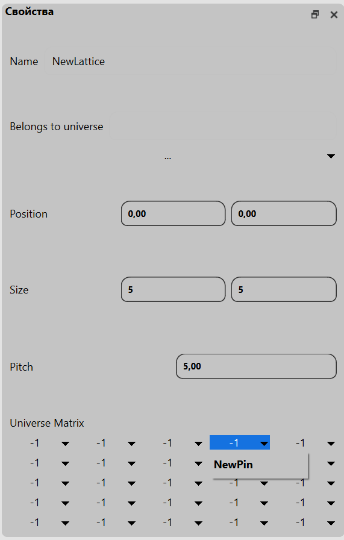

>**Детекторы**
> 
> При создании детектора можно выбрать его тип. От типа зависит то, какие свойства 
> детектора можно будет редактировать. 
> 
> Детекторы типа `Material` и `Lattice` схожи между собой. При нажатии на кнопку `...` 
> вы можете выбрать соответственно материал или решетку, в которой будет определяться
> ваш детектор.
> 
> Детектор типа `Mesh` имеет два способа задания сетки: `Spherical` и `Cylindrical`.
> - Если вы выбрали способ `Spherical`, то вам необходимо будет указать радиус и два
> угла.
> - Если вы выбрали способ `Cylindrical`, то вам необходимо будет указать радиус, угол 
> и высоту.
> 
> Первый столбец в таблице обозначает минимальное значение координаты, второй - максимальное
> значение координаты, третий - количество точек.
>> _В случае, если вы переключили режим задания сетки, а заголовки полей не поменялись,
> попробуйте переключиться на другой элемент и снова выбрать детектор, с которым вы работали._

 
>**Области**
>
> Данный вид элементов не обладает свойствами, которые можно редактировать.